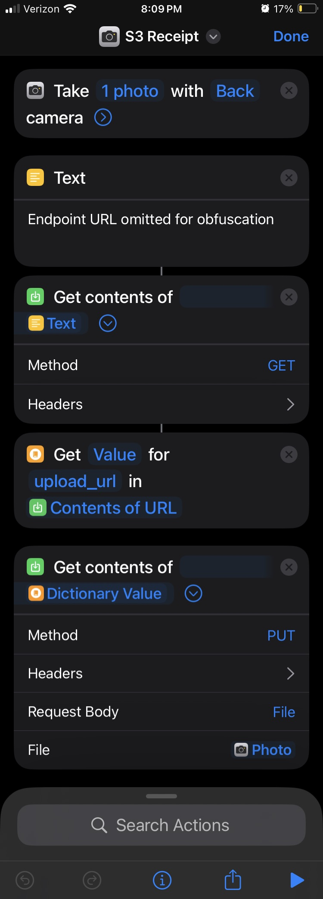

One of the most common forms of personal financial data is a paper receipt. In the past, I've tracked these by hand. That process is time intensive and annoying. I've always wanted a way to capture a paper receipt at the time I receive it and automatically ingest it into my personal ledger. Now, after some iteration, I've landed on an approach that involves 3 clicks on an iPhone and about $0.01 per use on AWS. Here's how it works.

The driving requirement for me is friction. I want there to be as little as possible. In operation, there have to be as little actions necessary from me to get a receipt into an ingestion engine. Keeping the amount of actions low makes it much more likely I'll stick to the process in my daily life. In development, there must be as little code as is necessary to ensure reliable execution. I don't want to have to install anything, and I want to maintain as little as possible. 

The most conveniant way to provide a receipt is with my smartphone. It's with me almost every time I receive a receipt. I use an iPhone, and iOS has a reputation for having limited configurability by a user. But iOS has a trick up its sleeve. iOS shortcuts allow you to [make standard HTTP requests to API endpoints](https://support.apple.com/guide/shortcuts/request-your-first-api-apd58d46713f/ios). With a simple web API, and a few chained lambda functions, I set up a small AWS architecture to ingest and store my receipts.

To start, my shortcut (click 1) opens the camera app and prompts me to snap a photo. After I've taken and confirm the photo (clicks 2 and 3), my interaction with the process is over.

Photos are too large to upload in a single POST request, so my shortcut begins by asking for a pre-signed upload URL for S3. A GET request is made to my API, which in turn activates a Lambda function to generate and return the pre-signed URL. Once the shortcut receives the URL, the shortcut sends a POST request using the URL and includes the photo taken as the file. Inside AWS, another Lambda function writes the image to an S3 bucket. This write event triggers one last Lambda function to feed the image into the [AWS Textract](https://docs.aws.amazon.com/textract/latest/dg/API_AnalyzeExpense.html) service where expense details are extracted and stored as a JSON document in S3. 

# Next steps
All the development for this was done in the AWS web console. This is unwieldy even for such a limited architecture. I'm researching a solution that will allow me to develop and test in a dedicated environment, then deploy without interacting with the web console. 

What about that ingestion into the personal ledger bit? I'm researching ledger solutions. In the past I've used [GNUCash](https://www.gnucash.org/), but GNUCash is not as easy to automate as some other other soluitions I've seen around. [Beancount](https://github.com/beancount/beancount) for example. I'm excited for it though. More than likely it's going to require building a container for the ledger instance, then working with AWS container services to run it on demand.

This is a proof of concept. If I'm going to have this always online in production there are some security considerations I need to make here.

## Security Considerations
Let's start at the entry point, API Gateway. I will be using this API rarely relative to how frequently AWS assumes an API to be used. I mean heck, the pricing calculator for API Gateway defaults to a factor of millions of requests per month. I have less than 100. That means I can set my rate and burst limits extremely low and limit my exposure to paying for someone else's requests.

Let's say someone does make a successful request. Currently, there's no mechanism verifying the request comes from an authorized source. So a pre-signed URL will be given to anything that makes a GET request on that API. That's a glaring issue. I'll have to research this one. What comes to mind is to include a unique ID in the header of my requests. I'm no security expert though, and this is well worth the research.

Let's say further that _something_ is uploaded to my S3 bucket. Currently the artifact is checked or sanitized. This is another oppurtunity for research. Textract is the largest expense of this process (heck you could argue its the only expense at this scale). If I can confirm the artifact is a receipt before I feed it through Textract, I don't make an unnecessary expenses and I don't introduce erroneous data into my ledger.

## Opportunities for Refactor
The lambda that receives the image can share it directly with the Textract API and write both products to S3. However, given that [movement of data between S3 and other AWS services in the same region has no cost](https://aws.amazon.com/s3/pricing/#:~:text=Data%20transferred%20between%20S3%20buckets%20in%20the%20same%20AWS%20Region.) it may be better from a testing perspective to have these two events separate. It's always easier to mock, verify, and maintain when responsibilities are separate, no matter how trivial the difference.

The data products of AWS Textract are in JSON format. Several of the fields need to be queried for ingestion into a ledger. Why not include these products in DynamoDB? True they would fit the DynamoDB paradigm well, but these data products are not accessed with the frequency that would merit the use of a database. They live as records. They'll be ingested once into a ledger, then stored for record-keeping. 

# Nickel, the larger scope
This process is one in a growing project. I'm calling the project Nickel. It's a personal finance engine. I'll be writing about the proposed architecture and scope of the project soon.
